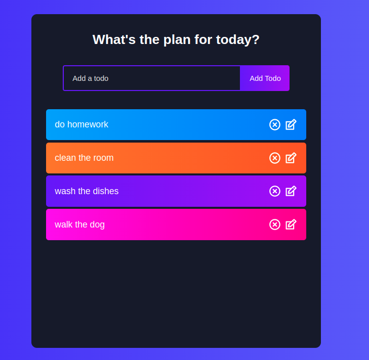
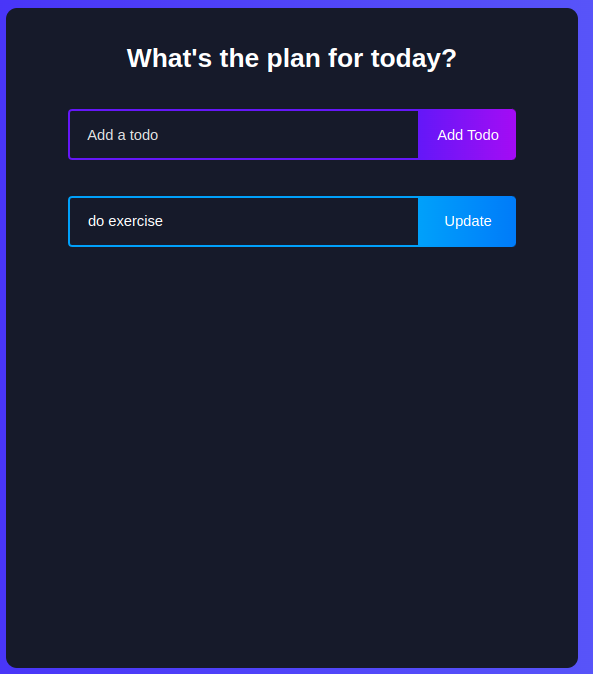

# React todo app

This is an exercise with react, where we use React hooks like useState, useRef and useEffect.
In the application you can create, edit, delete and mark your tasks.

## Screenshots

